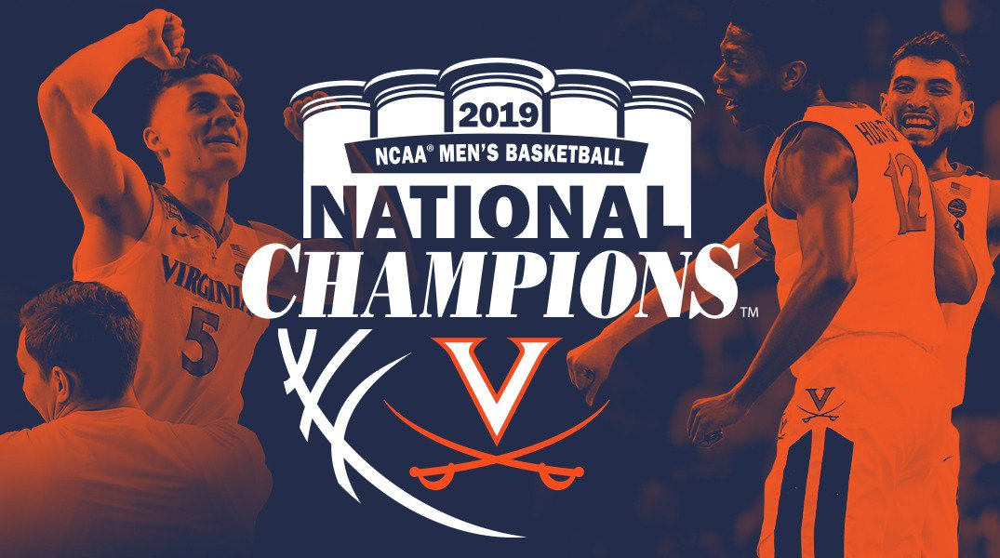

# BIOS-611-Project

  The dataset with variable descriptions and more context can be found [here](https://www.kaggle.com/andrewsundberg/college-basketball-dataset) 
  
  Men's college basketball is a widely popular sport, especially at the Division 1 level and is broadcasted nationally for fans to watch. According to Cav's Corner, the UVA men's basketball team is one of the top revenue generators for the school. Since the UVA men's basketball team won the national championships in 2019, I am interested in looking at various game statistics and their influences on the number of games won by a team. 
  

  
  Teams who win more games may be more likely to generate a larger fan base, more revenue for the school, and may be more likely to be projected to win the March Madness tournament.
  
  Being able to analyze specific predictors may also give coaches guidance for focusing practices on important skills and areas that may be lacking. 
  
  The dataset includes D1 college basketball statistics from the 2013-2021 seasons. however, I will just be focusing on the 2019 NCAA D1 basketball season since that is both the year that UVA won the national championships and the last pre-COVID season. 
  
  The dataset was found on kaggle and was scraped from barttorvik.com, a famous college basketball website. 
  
## Usage

To run this project, you will need Docker and the ability to run Docker as your current user. Please begin by building the docker container based on rocker/verse and run the R studio server. Then, connect to the machine using port 8787

  > docker build . -t project1-env
  
   > docker run -v `pwd`:/home/rstudio -p 8787:8787\
      -e PASSWORD=mypassword -t project1-env

